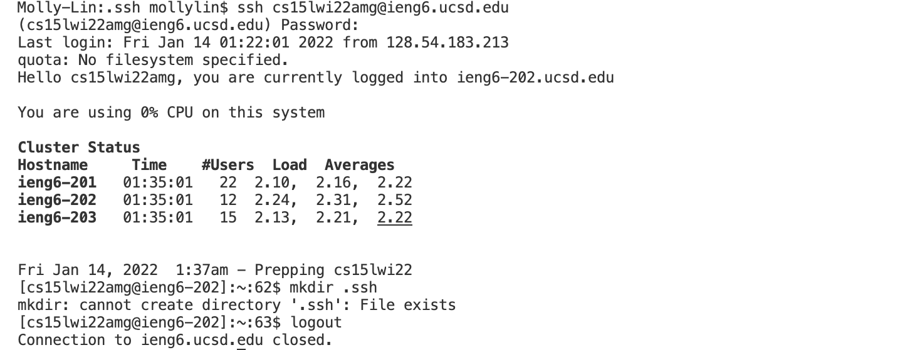

# Lab Report 1

#### *VSCode setup, remote access, and simple commands* 
 
 

### Part One: VSCode setup

#### *Step 1: Installing VScode*

The download link is here: [VSCode](https://code.visualstudio.com/)  (remember to use Safari instead of Chrome!)

A successful download page should look like this:

***

 

### Part Two: Remote Access

#### *Step 2: Remotely Connecting*

First find your course account on [ETS](https://sdacs.ucsd.edu/~icc/index.php) and change your password to activate it. Record your course-specifc username (*cs15lwi22amg*).

Then open VSCode terminal and type in `ssh <username>@ieng6.ucsd.edu`. Enter your password if required. If you successfully connect to ieng6 server, your terminal will show a message like this:

***

 

### Part Three: Commands
#### *Step 3: Trying Some Commands*

After logging in, you can start with some simple commands:

> `pwd` shows your current location

> `cd ~` directs you to home directory

> `ls` commands (`ls -lat`, `ls -a`, `ls /home/linux/ieng6/cs15lwi22/<username>` )show things in your current directory

> `cp /home/linux/ieng6/cs15lwi22/public/hello.txt ~/` copies the hello.txt file to your home directory

> `cat /home/linux/ieng6/cs15lwi22/public/hello.txt` prints out the content of hello.txt

(if hello.txt is some file that you have access to)

To log out: 
> type  `exit` or use Ctrl-D

#### *Step 4: Moving Files with `scp`*
A java file WhereAmI.java is created on client (your laptop). It contains `getProperty` commands that returns your system property. To copy this file to ieng6 server, run `scp` command on your local machine.

> `scp WhereAmI.java <username>@ieng6.ucsd.edu:~/`

This is what you'll see if you compile&run the file locally, scp it, and compile&run it on server:

#### *Step 5: Setting an SSH Key*

First, run `ssh-keygen` on your laptop . Go to `.ssh` directory. You'll see two files `id_rsa` and `id_rsa.pub` that contain *private* and *public* key respectively.

Then, ssh to server and create a new directory `.ssh` there with `mkdir .ssh`.

Log out and `scp` the public key to server `.ssh` directory.

This enables you to log in the server without password.

#### *Step 6: Optimizing Remote Running*
Here are some tips to improve efficiency:

* add commands after `ssh`

or

* separate multiple commands with `;`

or

* combine commands with `" "`

For the example above, if the commands are separated, there would be three keystrokes in total: ssh, pwd and ls. Under this specific case only one keystroke is needed, which saves two keystrokes. 
