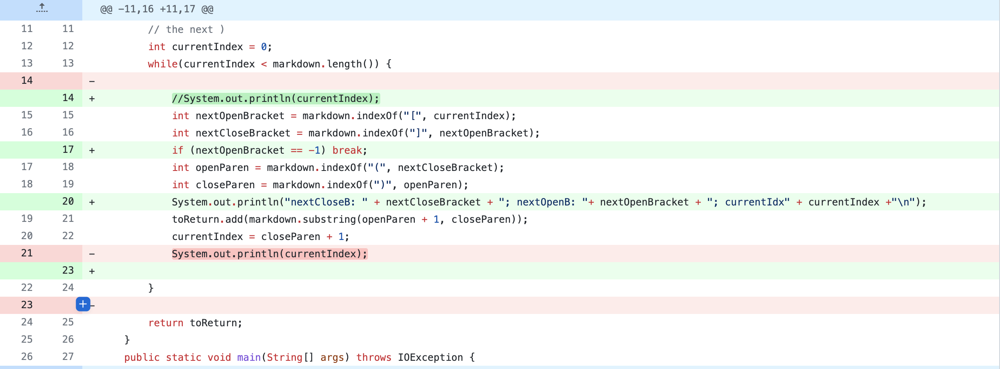
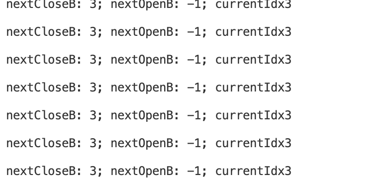
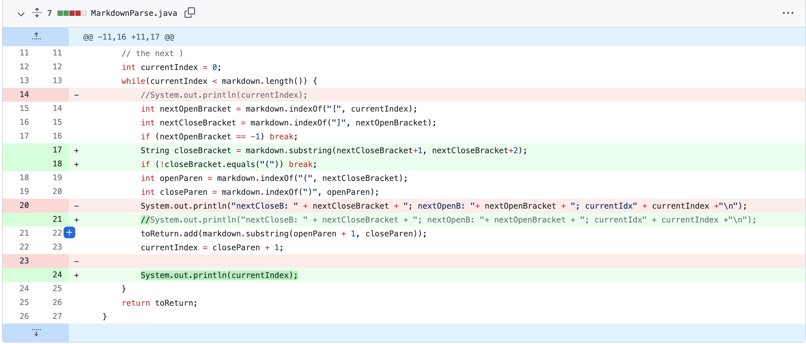
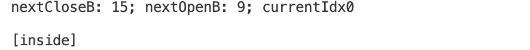
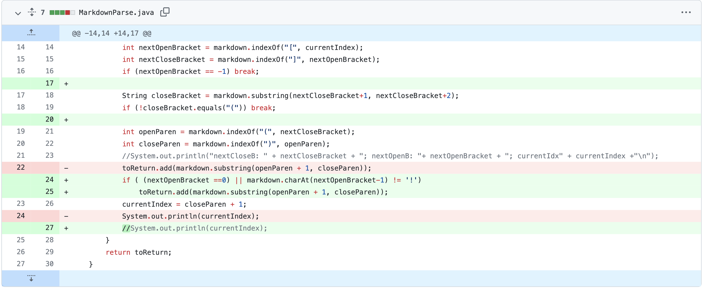
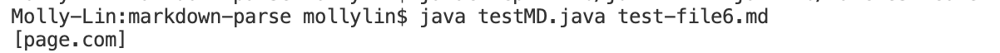

# Lab Report 2

### *Testing and Debugging* 
 

### Issue One

This fix (line 17) is for [lab.md](https://github.com/annakkin/markdown-parse/blob/43a54e1f44c715c08541aa61a9f8e105ddee7413/test-file.md)

The symptom I got before change is an infinite loop:

 The original code does not functino properly if the open parenthesis appears before the next close bracket. This is why it creates an infinite loop, as it cannot find the open bracket when it loops over.

 

### Issue Two

This fix (line 18) is for [labnew.md](https://github.com/annakkin/markdown-parse/blob/43a54e1f44c715c08541aa61a9f8e105ddee7413/labnew.md)

The symptom I got before change is an incorrect output, as for this file nothing is supposed to be printed:

The original code does not work for the case where there are text (or anything) between the close bracket and open paranthesis. This is not a proper format for link in markdown but cannot be recognized, as something is still printed. The correct format should be the open paranthesis right following the close bracket. By adding the new lines the code judges whether "(" is next to "]".

 

### Issue Three

This fix (line 24-25) is for [test-file6.md](https://github.com/annakkin/markdown-parse/blob/43a54e1f44c715c08541aa61a9f8e105ddee7413/test-file6.md)

The symptom I got before change is also incorrect output, as nothing should be printed:

 The original code cannot differentiate the format of a link and an image. Nothing should be printed if it is an image. The new lines adds a condition to determine if there is an extra "! before "[". If it does, nothing will be added to the toReturn substring.

 
 

note: to see all commits follow [this link](https://github.com/annakkin/markdown-parse/commits/main)