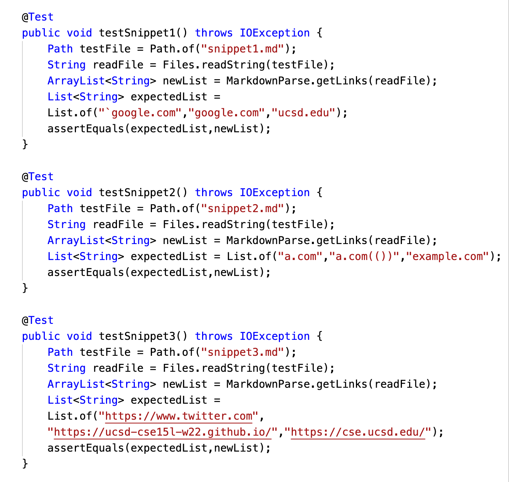
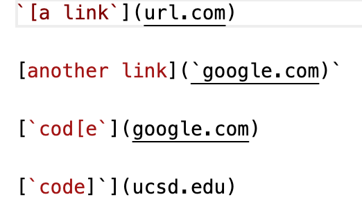
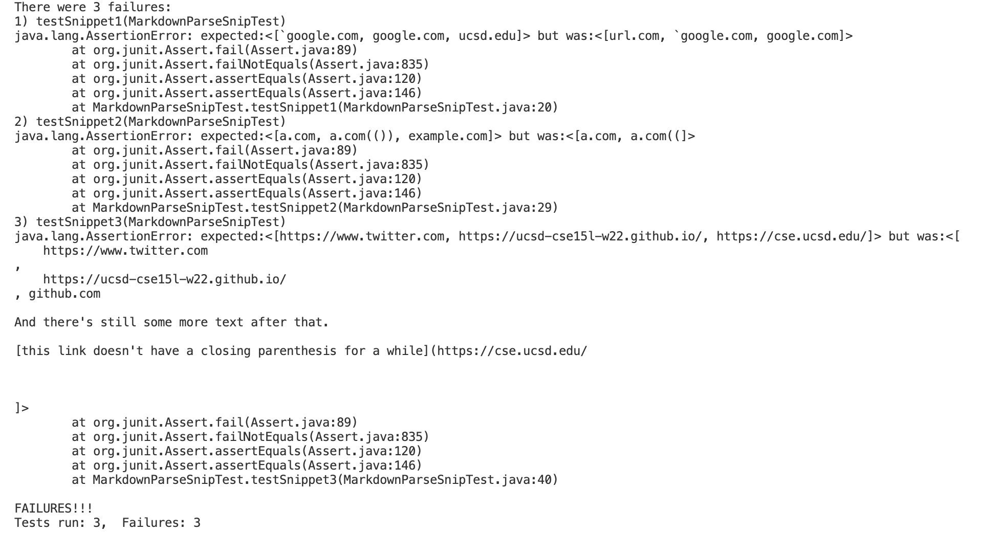
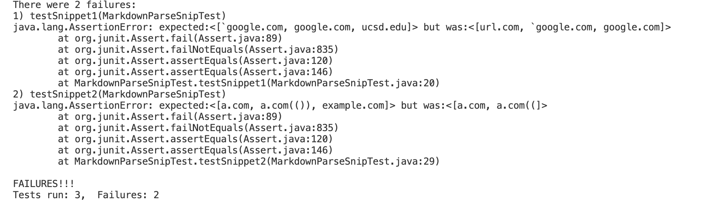

# Lab Report 4

### review, debug and improve
 
 
 

#### LINKS
Here is the link to our implementation: [annakkin](https://github.com/annakkin/markdown-parse)

Here is the link to the implementation of the group we reviewed:
[vs2961](https://github.com/vs2961/markdown-parse)  

 

 

#### EXPECTED OUTPUT, TESTING CODES, AND ACTUAL OUTPUT

Using VSCode preview as reference, the expected rusults are as follows: 

Snippet 1: [`google.com, google.com, ucsd.edu]

Snippet 2: [a.com, a.com(()), example.com]

Snippet 3: [https://www.twitter.com, https://ucsd-cse15l-w22.github.io/, https://cse.ucsd.edu/]

***

Here are the testers, where each of the md files contains the corresponding texts for snippet 1-3. 

for instance, the content of `snippet1.md` is just:

exactly the same as write-up.

***

* Our implementation fails all three testers:

* The group we reviewed fails the first two testers:

 
 

#### REFLECTION

1. BACKTICKS 

> For examples in snippet 1, maybe we can add lines to find the outermost paired bracket before the open paranthesis in a single line.  
If there is a backtick right before the open bracket of that pair (or right after close bracket for sure), it will not be a valid link.  
Also, inside the paired brackets, if there is a backtick right after the open brakcet and one right before the close bracket, it is a valid link. 

> However, if there is only one backtick either right before close bracket or right after open bracket, we need to check for an unpaired bracket. A link will be invalid if there is an unpaired close bracket.

***

2. NESTED PARENTHESES, BRACKETS, AND ESCAPED BRACKETS

> For snippet 2, if we add check to paired parentheses/brackets/escaped brackets for the outermost bracket pair with the close bracket before the open parenthesis and consider this a valid link, the test should pass.   

> We need to additionaly check for close bracket as well. If there exists an unpaired close bracket (that is not escape bracket!!) inside that bracket pair, we would recognize it as an invalid link.

***

3. NWELINES IN BRACKETS AND PARENTHESES

> For snippet 3, one way is to trim blankspaces after the open parentheses and before the close parentheses.  
We then look for the newline character `\n` inside the string. If there is no `\n` and the string is in a link format, it is then valid. Else, it will be invalid. 

 

 
