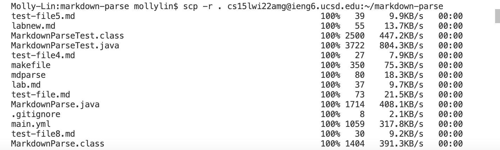
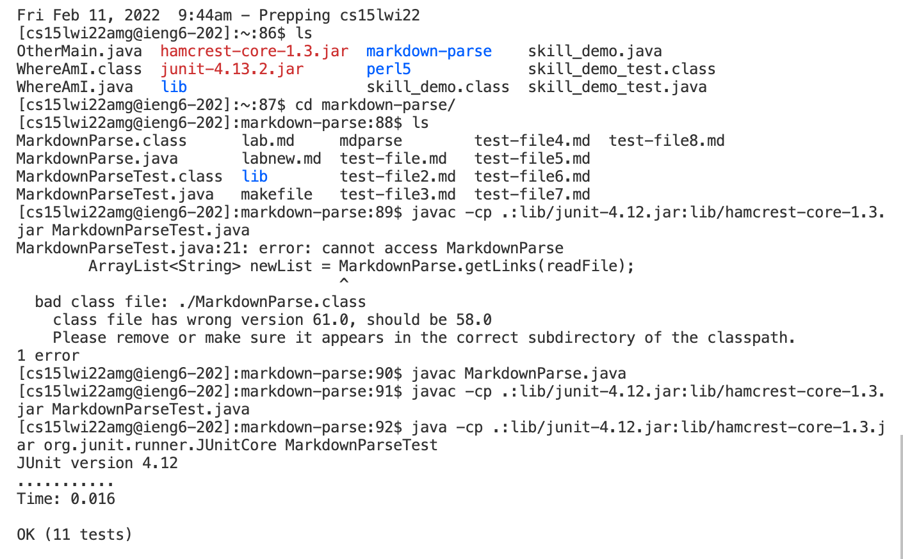
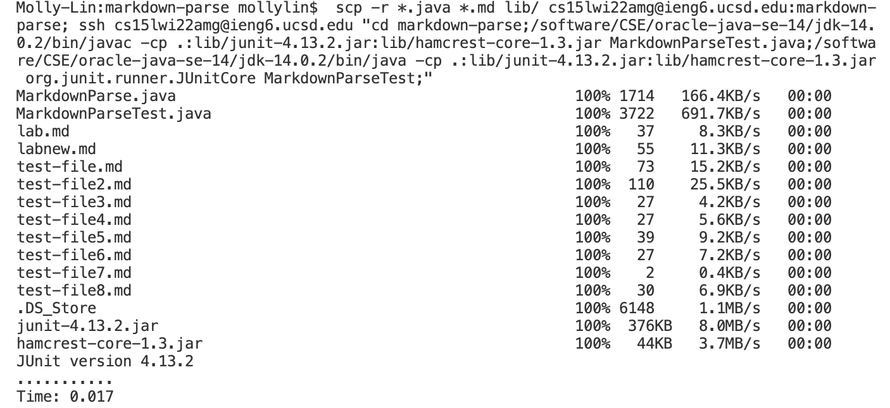

# Lab Report 4

### review, debug and improve
 
 
 

#### LINKS
Here is the link to our implementation: [annakkin](https://github.com/annakkin/markdown-parse)

Here is the link to the implementation of the group we reviewed:
[vs2961](https://github.com/vs2961/markdown-parse)  

 

#### Expected output and testing codes

Using VSCode preview as reference, the expected rusult are as follows: 

Snippet 1: 

Snippet 2:

Snippet 3: 

(1) copy the `markdown-parse` directory to ieng6 server with `scp -r`. It is in a recursive pattern. 

 (partially shown)

 

(2) `ssh` onto the server, compile and run `MarkdownParseTest`

The file compiles and runs, and all the tests pass. 

 ( `MarkdownParseTest` is recompile due to an error caused by wrong version)

 

(3) Combine `scp`, `ssh` and other commands on the server

For the combined command only `.java` java files, `.md` test files, and the whole `lib` directory that contains two `.jar` libraries (no class files) are copied to the server to avoid the wrong version issue. 

`/software/CSE/oracle-java-se-14/jdk-14.0.2/bin/java` is used to solve problems caused by different java versions in local and remote environment. 

 
