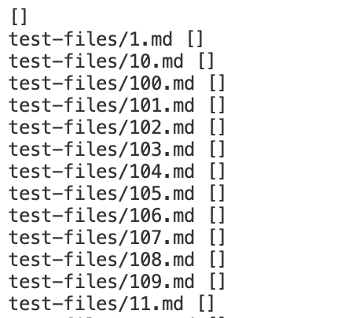

# Lab Report 5

### compare implementations, massive tests
 
 
 

#### FIND TESTS WITH DIFFERENT RESULTS

To compare, first add `echo` to the bash file to show file names when printing out test results.

******

Then export all test results to a text file for each implementation using `bash script.sh > <filename>.txt` in terminal.

The text files should look like below: 

<em> (partially shown) </em>

******

Compare two text files (supposed to have the exact same format) with `diff`. Results are printed in terminal. 

<em> (also partially shown) </em>

 

#### TEST 1: `193.md` 

For this test, the provided implementation is correct. 

My implementation gives `test-files/193.md []`. 

The provided implementation gives `test-files/193.md [url]`.

The actual output should be `/url`, according to `193.html.test`.

This is because my implementation didn't deal with the new line character `\n` in the `getLinks()` method. 

Code blocks can be added after this part.

 

#### TEST 2: `578.md`

For this test, my implementation is correct. 

My implementation gives `test-files/578.md []`. 

The provided implementation gives `test-files/578.md [/url]`.

The actual output should be empty according to `578.html.test`.

This is because the provided implementation didn't deal with the image format in markdown file. 

Implementation can be added to test the existence of `!` before the open bracket. If there is `!` it is not a valid link.

The condition can be added either before or after this part. 

 

 